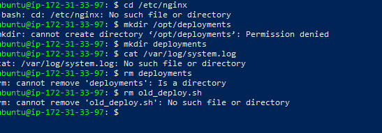

# Critical Thinking Project: Operating System Basics in DevOps Automation and Scaling

## Task 1: Linux vs Windows for DevOps Automation

## Comparison Report

When evaluating operating systems for DevOps automation, the two major contenders are **Linux** and **Windows**. Each offers unique strengths, but their suitability depends on scripting capabilities, package management, and containerization support.

### 1. Scripting Abilities

* **Linux**:

  * Built with powerful scripting support through **Bash**, **Python**, and other shell interpreters.
  * Native support for cron jobs, system automation, and pipelines.
  * Scripts are portable across nearly all Linux distributions.

* **Windows**:

  * Relies on **PowerShell** for automation.
  * Provides advanced object-oriented scripting capabilities, but lacks the simplicity and ubiquity of Bash in cloud environments.
  * Limited portability compared to Bash, especially outside Windows environments.

**Verdict:** Linux has simpler, widely adopted scripting for DevOps pipelines.

---

### 2. Package Management

* **Linux**:

  * Uses package managers such as **apt**, **yum**, or **dnf**.
  * Thousands of packages available with one-line installation.
  * Easy to integrate into automation scripts (e.g., `apt-get install -y`).

* **Windows**:

  * Historically lacked strong package management, though **Chocolatey** and **winget** now provide this functionality.
  * Adoption is still less common in DevOps pipelines compared to Linux package managers.

**Verdict:** Linux package management is more mature and widely supported in DevOps environments.

---

### 3. Containerization

* **Linux**:

  * Containers (Docker, Podman, Kubernetes) were built on Linux kernel features such as **cgroups** and **namespaces**.
  * Native compatibility makes Linux the default choice for container-based deployments.

* **Windows**:

  * Supports Docker, but compatibility is limited and often requires Linux virtual machines.
  * Kubernetes support is less stable compared to Linux nodes.

**Verdict:** Linux is the industry standard for containerization.

---

### Conclusion & Recommendation

While both Linux and Windows can be used for DevOps, **Linux is the superior choice** for automation, scalability, and containerized microservices. It offers:

* Native and simple scripting with Bash.
* Mature package management systems.
* First-class container support.

**Recommendation:** The company should standardize on **Linux** for DevOps automation and scaling. This will provide better compatibility with modern cloud tools, smoother automation, and reduced complexity in managing distributed environments.

# Task 2: Linux Command-Line Guide

As a junior DevOps engineer, knowing basic Linux commands is crucial. Below is a guide with explanations, DevOps use cases, and examples.

---

### 1. **ls** – List Files and Directories

* **What it does:** Displays the contents of a directory.
* **Why it’s useful:** Helps you quickly see which files, scripts, or configuration files are present in a directory.
* **Example (DevOps context):**

  ```bash
  ls -l /var/log
  ```

  *Lists system log files to check for errors or monitoring output.*

---

### 2. **cd** – Change Directory

* **What it does:** Moves you to a different directory in the filesystem.
* **Why it’s useful:** Essential for navigating server file structures to manage configs, logs, or deployments.
* **Example (DevOps context):**

  ```bash
  cd /etc/nginx
  ```

  *Navigates to the Nginx configuration directory before editing config files.*

---

### 3. **mkdir** – Create Directories

* **What it does:** Creates a new directory.
* **Why it’s useful:** Organizes files, scripts, or deployments into structured directories.
* **Example (DevOps context):**

  ```bash
  mkdir /opt/deployments
  ```

  *Creates a dedicated directory for storing application deployment files.*

---

### 4. **cat** – View File Contents

* **What it does:** Displays the content of a file directly in the terminal.
* **Why it’s useful:** Allows quick inspection of logs, configs, or script outputs.
* **Example (DevOps context):**

  ```bash
  cat /var/log/system.log
  ```

  *Reads system log output to diagnose issues.*

---

### 5. **rm** – Remove Files

* **What it does:** Deletes files (and with options, directories).
* **Why it’s useful:** Cleans up unnecessary logs, temporary files, or outdated builds.
* **Example (DevOps context):**

  ```bash
  rm old_deploy.sh
  ```

  *Removes an outdated deployment script.*

---

### I added Screenshots




 **Summary:**
These five commands—`ls`, `cd`, `mkdir`, `cat`, and `rm`—form the backbone of Linux server management. In DevOps, they are used daily for file navigation, log inspection, directory management, and cleanup tasks.

# Task 3: User Management and Permissions Documentation

As a DevOps engineer, securing servers with proper user management and permissions is critical. Below is a step-by-step guide.

---

## 1. **Create a New User**

```bash
sudo adduser devopsuser
```

* **What it does:** Creates a new user called `devopsuser`.
* **Why it’s useful:** In DevOps, separating users improves accountability and prevents accidental system-wide changes.

---

## 2. **Set a Password for the User**

```bash
sudo passwd devopsuser
```

* **What it does:** Sets a login password for `devopsuser`.
* **Why it’s useful:** Ensures secure authentication for each user.

---

## 3. **Add User to the Sudo Group (Optional)**

```bash
sudo usermod -aG sudo devopsuser
```

* **What it does:** Gives `devopsuser` administrative privileges.
* **Why it’s useful:** Required if the new user needs to run administrative commands (like managing services).

---

## 4. **Verify File Ownership and Permissions**

```bash
ls -l
```

* **What it does:** Lists files with ownership and permissions.
* **Example Output:**

  ```
  -rwxrwxr-x 1 ubuntu ubuntu    634 Sep 30 20:52 monitor.sh
  ```
* **Why it’s useful:** Shows which user and group own a file, and what actions (read, write, execute) are allowed.

---

## 5. **Modify File Permissions with chmod**

```bash
chmod 740 monitor.sh
```

* **What it does:** Sets file permissions:

  * `7` = Owner can read, write, execute
  * `4` = Group can read
  * `0` = Others have no access
* **Why it’s useful:** Ensures only authorized users can run sensitive scripts.

---

## 6. **Change File Ownership with chown**

```bash
sudo chown devopsuser monitor.sh
```

* **What it does:** Makes `devopsuser` the owner of `script.sh`.
* **Why it’s useful:** Assigns responsibility and prevents unauthorized editing.

---

##  Why User Management and Permissions Matter in DevOps

* **Security:** Prevents unauthorized access to sensitive files.
* **Accountability:** Each user’s actions can be tracked.
* **Least Privilege:** Users only get access they need—reducing risks.
* **Automation:** Properly set permissions ensure scripts and services run smoothly under controlled users.

---

### I added Screenshots


 **Summary:**
I created a new user, managed their access, and controlled file permissions with `chmod` and `chown`. These steps form the backbone of **secure server management in DevOps**.
