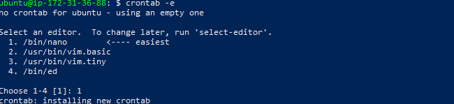
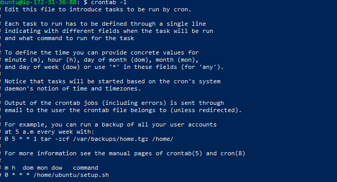
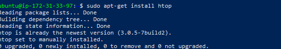

# Essential Commands in DevOps

## Task 1: Linux vs. Windows for DevOps Automation  

When choosing an operating system for DevOps automation, both Linux and Windows offer strong capabilities. However, Linux is often the preferred choice in most DevOps environments due to its flexibility, tooling, and compatibility.  

---

##  Key Comparisons  

### 1. **Scripting Abilities**
- **Linux:**  
  - Uses **Bash**, a lightweight and powerful shell scripting language.  
  - Scripts can easily automate package installs, server setups, container orchestration, and CI/CD tasks.  
  - Widely supported across DevOps tools.  
- **Windows:**  
  - Uses **PowerShell**, a feature-rich shell with object-oriented scripting.  
  - Strong integration with Microsoft tools (Active Directory, Azure).  
  - Less common in open-source DevOps environments.  

 **Winner: Linux** – Bash is simpler, faster, and more widely adopted in DevOps pipelines.  

---

### 2. **Package Management**
- **Linux:**  
  - Provides native package managers like **apt (Ubuntu/Debian)** and **yum/dnf (RHEL/CentOS)**.  
  - Automates installation and updates of system dependencies.  
  - Huge open-source ecosystem.  
- **Windows:**  
  - Tools like **Chocolatey** and **winget** exist but are less mature.  
  - Dependency management is more complex compared to Linux.  

 **Winner: Linux** – Robust, proven package managers designed for automation.  

---

### 3. **Container Compatibility**
- **Linux:**  
  - Containers (e.g., Docker, Kubernetes) were built **natively for Linux**.  
  - Runs efficiently with direct kernel features like cgroups and namespaces.  
- **Windows:**  
  - Supports Docker Desktop, but often relies on a **Linux VM backend**.  
  - Limited support for Kubernetes clusters.  

 **Winner: Linux** – Containers are first-class citizens in Linux.  

---

##  Conclusion
While Windows offers good integration with Microsoft ecosystems, **Linux clearly provides stronger support for DevOps automation** due to its:  
- Native Bash scripting  
- Robust package management  
- Superior container compatibility  

**Final Choice: Linux is the better OS for DevOps automation.**


## Task 2: Configuring the OS with Bash Scripts

## Objective

Use a Bash script to automate common Linux server tasks:

* Update OS packages
* Install essential tools
* Enable the firewall

---

## Step 1: Create the Script

Open a new file called `setup.sh`:

```bash
nano setup.sh
```

Paste the following code:

```bash
#!/bin/bash

# Update OS packages
sudo apt-get update -y
sudo apt-get upgrade -y

# Install essential tools (if needed)
sudo apt-get install -y ufw

# Enable firewall
sudo ufw enable

echo "✅ System updated and firewall enabled."
```

---

## Step 2: Make Script Executable

Run:

```bash
chmod +x setup.sh
```

---

## Step 3: Run the Script

Execute it:

```bash
./setup.sh
```

### I added Screenshots


---

## Step 4: Schedule with Cron

To make this run **daily at midnight**, edit crontab:

```bash
crontab -e
```

Add this line:

```
0 0 * * * /path/to/setup.sh
```

*(Replace `/path/to/setup.sh` with the actual path to your script, e.g., `/home/ubuntu/setup.sh`)*

---

### I added screenshot




## Verification

* Run `ufw status` → should show firewall as active
* Check logs to confirm updates ran
* Run `crontab -l` → should list your cron job


# Task 3: System Monitoring and Logging

## Objective

Track and log system performance data.

---

## Step 1: Install `htop` for Real-Time Monitoring

```bash
sudo apt-get install htop
```

Run it with:

```bash
htop
```

### I added Screenshots


---


## Step 2: Create the Monitoring Script

Create and open a new file:

```bash
nano monitor.sh
```

Paste the script:

```bash
#!/bin/bash
while true; do
    echo "$(date) - CPU: $(top -bn1 | grep 'Cpu(s)' | awk '{print $2 + $4}')% | MEM: $(free | awk '/Mem/{printf \"%.2f\", $3/$2 * 100.0}')" >> /var/log/system_metrics.log
    sleep 60 # Log every 60 seconds
done
```

---

## Step 3: Make It Executable

```bash
chmod +x monitor.sh
```

---

## Step 4: Run the Script in the Background

```bash
sudo nohup ./monitor.sh &
```

Check running processes:

```bash
ps aux | grep monitor.sh
```

---

## Step 5: View the Logs

```bash
cat /var/log/system_metrics.log
```

Example output:

```
2025-09-30 20:53:39 - CPU: 9.7% | MEM: 20.0% | DISK: 12%
2025-09-30 20:54:39 - CPU: 3.3% | MEM: 20.0% | DISK: 12%
```


