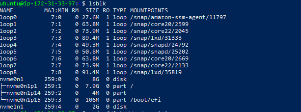
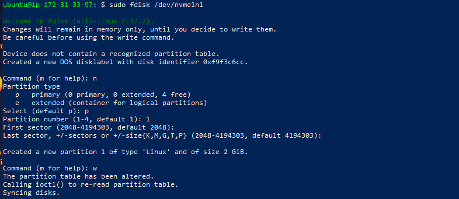
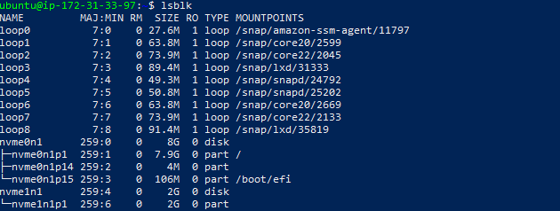
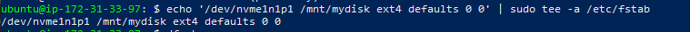

# Disk Management and Mounting

In this project, I learned how to manage disks, create partitions, and mount filesystems in Linux.  
Here is a step-by-step record of what I did:

---

## Step 1: Listed All Disks
I used the `lsblk` command to see all available disks and partitions.

```bash
lsblk
```

**Output (excerpt):**
```
nvme0n1      259:0    0    8G  0 disk
├─nvme0n1p1  259:1    0  7.9G  0 part /
├─nvme0n1p14 259:2    0    4M  0 part
└─nvme0n1p15 259:3    0  106M  0 part /boot/efi
```

I noticed that i already had a partition, so i added a 2G new volume on my instance and attached. 

---

### I added  screenshots



## Step 2: Created a Partition
I opened the disk with `fdisk` and created a new partition.

```bash
sudo fdisk /dev/nvme1n1
```

Inside `fdisk`, I pressed:
- `n` → to create a new partition  
- `p` → to make it primary  
- `1` → as the partition number  
- Pressed **Enter** to accept defaults  
- `w` → to write changes

After this, I confirmed with:

```bash
lsblk
```

**Output showed:**
```
nvme1n1      259:4    0    2G  0 disk
└─nvme1n1p1  259:6    0    2G  0 part
```

I successfully created `/dev/nvme1n1p1`.

---

### I added Screenshots



## Step 3: Formatted the Partition
I formatted the partition with `ext4`:

```bash
sudo mkfs.ext4 /dev/nvme1n1p1
```

---

### I added Screenshots


## Step 4: Created a Mount Point
I created a directory to use as a mount point:

```bash
sudo mkdir /mnt/mydisk
```

---

## Step 5: Mounted the Partition
I mounted the new partition to `/mnt/mydisk`:

```bash
sudo mount /dev/nvme1n1p1 /mnt/mydisk
```

---

### I added Screenshots


## Step 6: Verified the Mount
I confirmed the mount with:

```bash
df -h
```

The output showed `/mnt/mydisk` with 2G available, which proved my mount was successful.

---

### I added Screenshots


## Step 7: Made the Mount Persistent
To make the partition mount automatically on boot, I added it to `/etc/fstab`:

```bash
echo '/dev/nvme1n1p1 /mnt/mydisk ext4 defaults 0 0' | sudo tee -a /etc/fstab
```
### I added Screenshots

---

I successfully managed a new disk, created a partition, formatted it, mounted it, and configured it for persistence. This taught me essential Linux disk management skills useful for DevOps automation.
