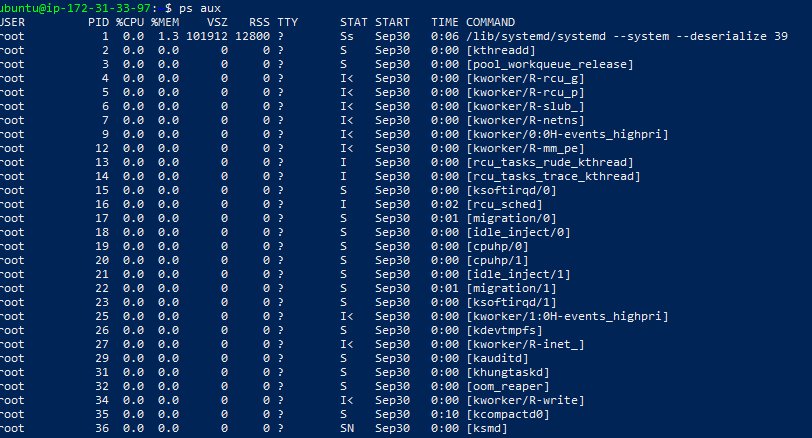
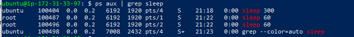

#  Process Management

---

## Objective  
I learned how to manage processes in Linux, including starting, stopping, and monitoring processes.  

---

## Steps I Took  

### 1. Start a Background Process  
I started a long-running process in the background using:  

```bash
sleep 300 &
```

Output:  
```
[1] 100404
```

### I added Screenshots


---

### 2. List Running Processes  
I listed all running processes with:  

```bash
ps aux
```

This showed me the running `sleep` process along with other system processes.  

### I added Screenshots


---

### 3. Kill a Process  
I found the process ID (PID) of the sleep process and killed it using:  

```bash
kill 100404
```

### I added Screenshots


---

### 4. Monitor System Resources  
I monitored system resources with:  

```bash
top
```

This displayed CPU, memory usage, and real-time process monitoring.  

### I added Screenshots
 priority changed to 5
```

### I added Screenshots


---

## Conclusion  
Through this project, I practiced:  
- Starting and stopping processes.  
- Monitoring system activity with `top`.  
- Managing process priorities using `nice` and `renice`.  

I now have a solid understanding of **Linux process management** and how to control system resources effectively.  
