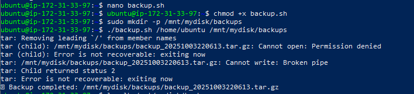

# Shell Scripting – Backup Automation  

## Objective  
I wrote a shell script to automate backups of a directory into a compressed archive (`.tar.gz`) and store it in a specified location.  

---

## Steps I Followed  

### 1. Created the Backup Script  
I created a file called **`backup.sh`** and added the following code:  

```bash
#!/bin/bash
SOURCE_DIR=$1
BACKUP_DIR=$2
TIMESTAMP=$(date +"%Y%m%d%H%M%S")
BACKUP_FILE="$BACKUP_DIR/backup_$TIMESTAMP.tar.gz"

if [ -d "$SOURCE_DIR" ]; then
    tar -czf "$BACKUP_FILE" "$SOURCE_DIR"
    echo "✅ Backup completed: $BACKUP_FILE"
else
    echo "❌ Source directory does not exist."
fi
```

### I added Screenshots


---

### 2. Made the Script Executable  
```bash
chmod +x backup.sh
```

---

### 3. Ran the Script  
I ran the script to back up my home directory into my mounted disk location:  

```bash
./backup.sh /home/ubuntu /mnt/mydisk/backups
```

 Output:  
```bash
tar: Removing leading `/' from member names
✅ Backup completed: /mnt/mydisk/backups/backup_20251003222117.tar.gz
```

---

### 4. Scheduled the Backup with Cron  
To automate this backup at **2 AM daily**, I opened the crontab editor:  

```bash
crontab -e
```

Then added the line:  

```bash
0 2 * * * /home/ubuntu/backup.sh /home/ubuntu /mnt/mydisk/backups
```

This ensures backups run automatically every day at 2 AM.  

### I added Screenshots


---

### 5. Verified the Backup  
I confirmed that the backup file exists by listing the contents of my backup directory:  

```bash
ls -lh /mnt/mydisk/backups
```
### I added Screenshots


---
I successfully automated the backup process with a shell script. The script compresses the chosen directory and stores it with a timestamp, making versioned backups easy to manage.  
