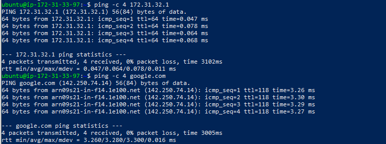
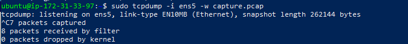
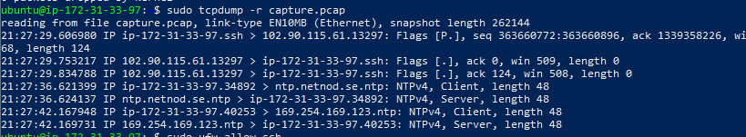
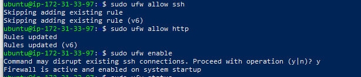
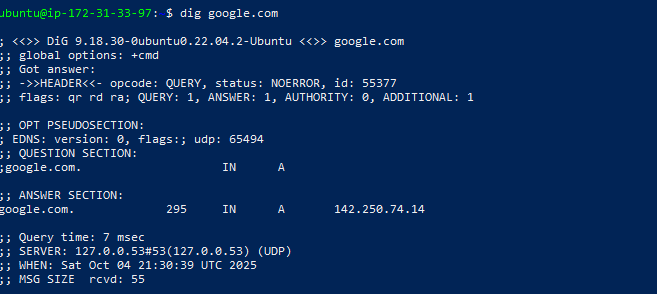

# Network Configuration and Troubleshooting

## Objective
In this project, I learned how to configure and troubleshoot network settings in Linux, including setting a static IP, testing connectivity, capturing network traffic, managing a firewall, and resolving DNS issues.

---

### 1. Checked Current Network Configuration
I viewed my system's network interfaces and their IP addresses using:
```bash
ip addr
```
Output showed my network interface **ens5** with the dynamic IP `172.31.33.97/20`.


### 2. Verified Default Gateway
I confirmed my default route and gateway using:
```bash
ip route
```
My gateway was `172.31.32.1`, confirming proper routing setup.

### 3. Reviewed Netplan Configuration
I checked the Netplan configuration file located at `/etc/netplan/50-cloud-init.yaml`:
```yaml
network:
    ethernets:
        ens5:
            dhcp4: true
            dhcp6: false
            match:
                macaddress: 0a:84:c1:01:1c:35
            set-name: ens5
    version: 2
```
Since this system uses **Netplan** (and not `/etc/network/interfaces`), I did not manually assign a static IP.

### 4. Tested Network Connectivity
I verified network connectivity by pinging both my gateway and Google:
```bash
ping 172.31.32.1
ping google.com
```
Both tests confirmed stable connectivity to the local network and the internet.

### I added screenshots


### 5. Captured Network Traffic
I used `tcpdump` to capture live traffic on my network interface and save it to a file:
```bash
sudo tcpdump -i ens5 -w capture.pcap
```
Then I reviewed the captured packets:
```bash
tcpdump -r capture.pcap
```

### I added screenshots



### 6. Configured the Firewall
I set up the **Uncomplicated Firewall (UFW)** to allow essential services and then enabled it:
```bash
sudo ufw allow ssh
sudo ufw allow http
sudo ufw enable
```
This ensures secure but open access to my EC2 instance for SSH and web traffic.

### I added screenshots



### 7. Troubleshooted DNS
I confirmed that DNS resolution was working correctly by running:
```bash
dig google.com
```
The output returned an IP address (`142.250.74.14`), proving DNS is functional.

### I added screenshots



---

## Outcome
I successfully configured, tested, and verified my network connectivity, routing, DNS, and firewall setup.

---


