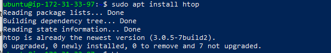
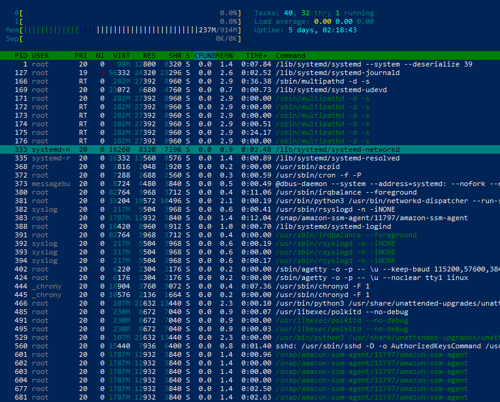
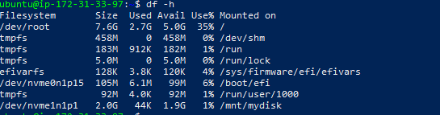
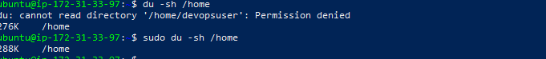
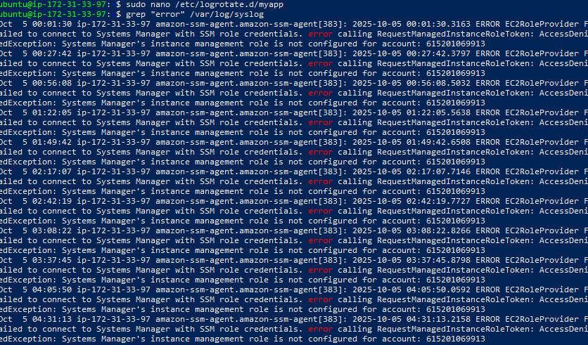
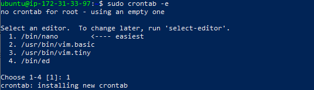

#  System Monitoring and Log Management Project

---
This project involved exploring Linux tools for monitoring system performance, checking disk usage, managing logs, and setting up alerts.  
Each task was performed step-by-step on a live Ubuntu instance to ensure practical understanding.

---

### 1. Monitor System Performance
- I Installed and launched **htop** to observe CPU, memory, and process usage.
  ```bash
  sudo apt install htop
  htop
  ```
- Verified real-time resource consumption and running processes.

### I Added Screenshots



### 2. Check Disk Usage
- I Used the `df` command to check overall disk space usage:
  ```bash
  df -h
  ```
- Checked the disk usage of the `/home` directory:
  ```bash
  sudo du -sh /home
  ```
- Output showed total disk usage of 288K for the `/home` directory.

### I Added Screenshots



---

### 3. Configure Log Rotation
- I Created a custom log rotation file for `/var/log/myapp.log`.
  ```bash
  sudo nano /etc/logrotate.d/myapp
  ```
- Added the following configuration:
  ```bash
  /var/log/myapp.log {
      daily
      missingok
      rotate 7
      compress
      delaycompress
      notifempty
      create 0640 root adm
  }
  ```
- This ensures logs are rotated daily, compressed, and stored safely.

### 4. Analyze System Logs
- I Searched for error entries in system logs using `grep`:
  ```bash
  grep "error" /var/log/syslog
  ```
- Found recurring **Amazon SSM Agent** errors indicating missing IAM role permissions.
- Verified that the errors were non-critical and understood their cause.

### I Added Screenshots


---

### 5. Set Up Disk Usage Alerts
- I Learned how to create a cron job to send email alerts if disk usage exceeds 90%:
  ```bash
  sudo crontab -e
  ```
- Example cron configuration:
  ```bash
  */10 * * * * df -h | awk '$5 > 90 {print $1, $5}' | mail -s "Disk Usage Alert" admin@example.com
  ```
- This script checks disk usage every 10 minutes and sends an email if limits are exceeded.

### I Added Screenshots


---

## Outcome
- Successfully monitored system resources using **htop**.  
- Checked disk usage and learned about log file rotation.  
- Analyzed real system errors from **/var/log/syslog**.  
- Understood how to automate alerts for critical disk usage. 
