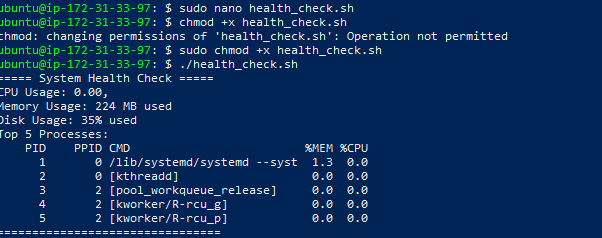
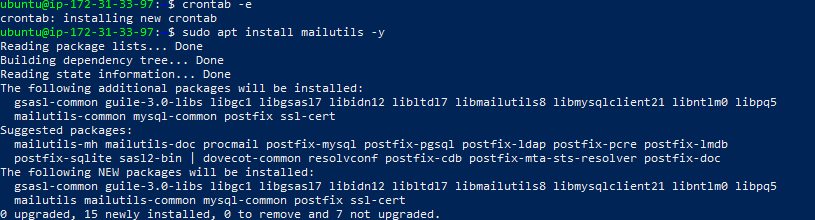

# Advanced Shell Scripting Project

**Objective:** Automate system administration tasks using advanced shell scripting techniques in Linux.

---

## 🧠 Objective
I developed an advanced shell script to monitor and automate system health checks in Linux — tracking CPU usage, memory consumption, disk space, and top processes, while optionally setting up email alerts for critical thresholds.

---

## ⚙️ Steps and Implementation

### **1️⃣ Created the Health Check Script**
I created a script named `health_check.sh` to check essential system metrics such as CPU, memory, and disk usage.

```bash
#!/bin/bash
echo "CPU Usage: $(top -bn1 | grep load | awk '{print $12}')"
echo "Memory Usage: $(free -m | awk '/Mem:/ {print $3 " MB used"}')"
echo "Disk Usage: $(df -h / | awk '/\// {print $5 " used"}')"
echo "Top 5 Processes:"
ps -eo pid,ppid,cmd,%mem,%cpu --sort=-%cpu | head -n 6
```

---

### **2️⃣ Made the Script Executable**
I granted the script execution permissions with:

```bash
chmod +x health_check.sh
```

---

### **3️⃣ Executed the Script**
I ran the script to check real-time system performance metrics:

```bash
./health_check.sh
```

### I added Screenshots


This displayed details like CPU load, memory usage, and the top five CPU-consuming processes.

---

### **4️⃣ Scheduled Hourly Execution via Cron**
I scheduled the script to automatically run every hour and log results for monitoring purposes:

```bash
crontab -e
```

Then I added this line:

```bash
0 * * * * /path/to/health_check.sh >> /var/log/health_check.log
```

This ensured the system health was logged regularly for review.


### I added Screenshots


---

### **5️⃣ Added Email Alerts for High CPU Usage**
I enhanced the script to send an email if CPU usage exceeded 90%. This feature helps maintain awareness of performance issues before they impact system operations.

---

