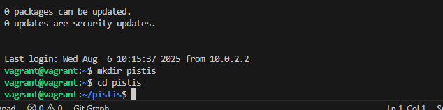
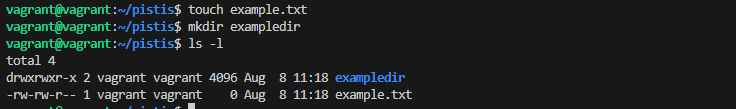
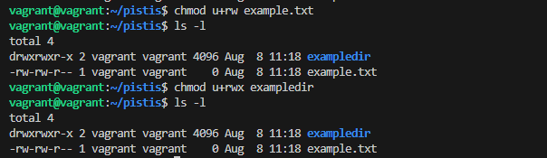
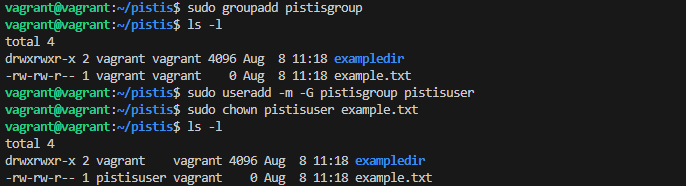
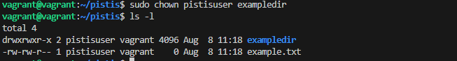
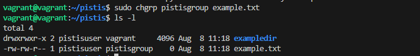
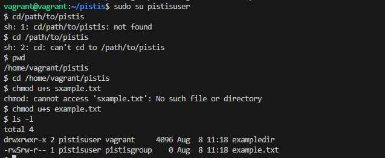
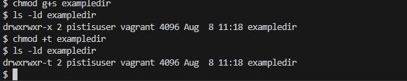
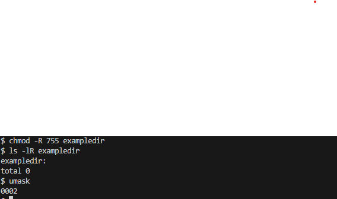

# Linux File and Directory Permissions Project

---

### Step 1:I Accessed the Linux System
i Used a Vagrant Linux box and accessed it using:
```bash
vagrant ssh
```

### Step 2: Open a Terminal
i Ensured i was in a terminal session.

### Step 3: I Created and Navigated to the Directory
```bash
mkdir pistis
cd pistis
```
## I added screenshots


### Step 4: I Created Files and Directories
```bash
touch example.txt
mkdir exampledir
```

### Step 5: I Listed the Files and Directories
```bash
ls -l
```
## I added screenshots


### Step 6: I Modified File Permissions (chmod)
```bash
chmod u+rw example.txt
ls -l
``` 

### Step 7: I Modified Directory Permissions (chmod)
```bash
chmod u+rwx exampledir
```
## I added screenshots


### Step 8: I Created a New Group
```bash
sudo groupadd pistisgroup
```

### Step 9: I Created a New User
```bash
sudo useradd -m -G pistisgroup pistisuser
```

### Step 10: I Changed the File Owner (chown)
```bash
sudo chown pistisuser example.txt
```
## I added screenshots



### Step 11: I Changed the Directory Owner (chown)
```bash
sudo chown pistisuser exampledir
```
## I added screenshots



### Step 12: I Changed the Group Ownership (chgrp)
```bash
sudo chgrp pistisgroup example.txt
```
## I added screenshots



### Step 13: I Verified Permissions and Ownership
```bash
ls -l
```

### Step 14: I Tested Access
```bash
sudo su pistisuser
cd /path/to/pistis
```
 ## I added screenshots
 


### Step 15: I set up Setuid, Setgid, and Sticky Bit

#### Setuid (Set User ID)
```bash
chmod u+s example.txt
ls -l
```
## I added screenshots
 

#### Setgid (Set Group ID)
```bash
chmod g+s exampledir
ls -ld exampledir
```

#### Sticky Bit
```bash
chmod +t exampledir
ls -ld exampledir
```
## I added Screenshots
 


### Step 16: I used Recursive Permissions
```bash
chmod -R 755 exampledir
ls -lR exampledir
```
## I added screenshots
 

### Step 17: I did Default Permissions (umask)

Check current umask:
```bash
umask
```

Change umask:
```bash
umask 0027
touch newfile
ls -l newfile
```
## i added screenshots
 
