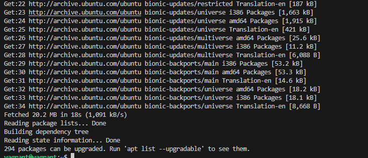
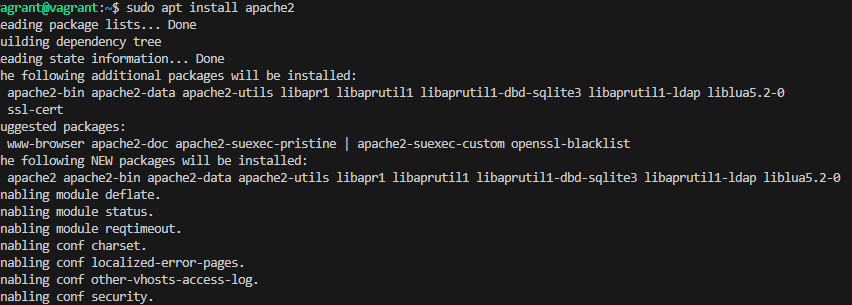
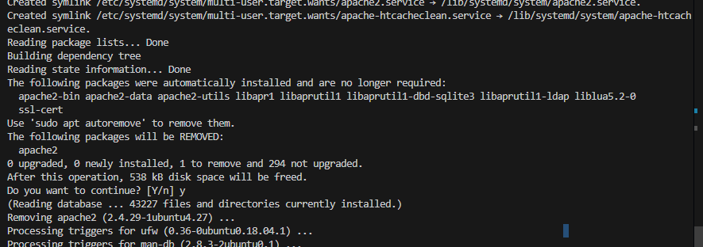
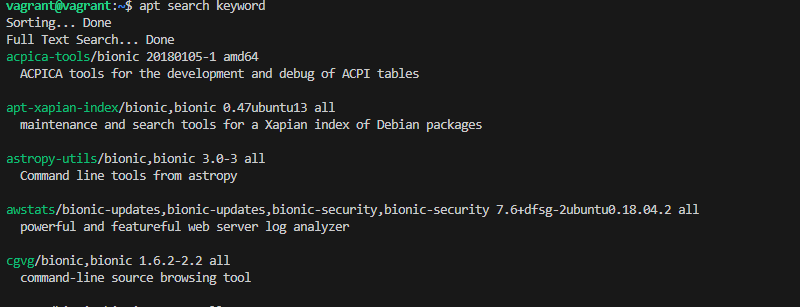
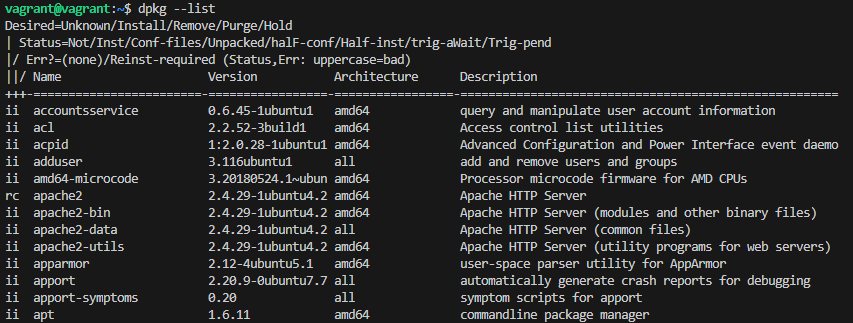
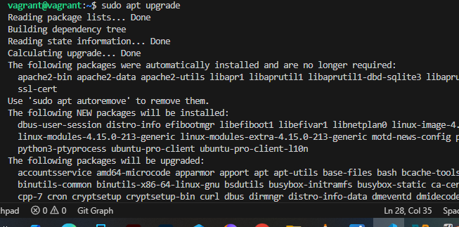

# Package Management Project

## Objective
I explored how to manage software packages on a Linux system using package management tools (`apt`, `yum`, or `dnf`).

---

## Step 1: Access the Linux System
I used a **Vagrant Linux box** and accessed it with:

```bash
vagrant ssh
```

---

## Step 2: Open a Terminal
Since I was already connected via SSH, I used the same terminal window to execute my package management commands.

---

## Step 3: Update Package Repositories
Before installing or updating packages, I updated the package repositories to get the latest package information. I used:
```bash
sudo apt update
```
### I added Screenshots 



---

## Step 4: Install a Package
I installed a new package by replacing `package-name` with the name of the package "apache2". I used:
```bash
sudo apt install apache2
```
### I added screenshots

---

## Step 5: Remove a Package
When I needed to remove a package, I ran:

```bash
sudo apt remove apache2
```
### I added screenshots

---

## Step 6: Search for Packages
I searched for available packages like this:
```bash
apt search keyword
```
### I added screenshots

---

## Step 7: List Installed Packages
I listed all installed packages on my system:

```bash
dpkg --list
```
### I added screenshots

---

## Step 8: Upgrade Installed Packages
Finally, I upgraded my installed packages to their latest versions.

**For Debian/Ubuntu (apt):**
```bash
sudo apt upgrade
```
### I added screenshots

---

 By completing this project, I learned how to update, install, remove, search, list, and upgrade software packages efficiently on Linux using both Debian-based and Red Hat-based package managers.
