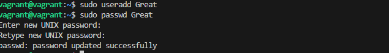

# User and Group Management Project

## Objective
In this project, I learned **how to manage user accounts and groups** on a Linux system.  
I personally created, modified, and deleted users and groups step-by-step.

---

## **Step 1: Access My Linux System**
I fired up my **Vagrant Linux box** and jumped into it using:
```bash
vagrant ssh
```

---

## **Step 2: Open My Terminal**
I made sure I was inside the terminal session, ready to execute my user and group management commands.

---

## **Step 3: Create a New User**
I created a fresh new user account:
```bash
sudo useradd Great
```

---

## **Step 4: Set a Password for My New User**
I gave my new user a password:
```bash
sudo passwd Great
```
I entered and confirmed the password.

 ### I added screenshots
 
---


## **Step 5: Create a New Group**
I made a new group for organizing users:
```bash
sudo groupadd Devops
```

---

## **Step 6: Add My User to the Group**
I connected my new user to my new group:
```bash
sudo usermod -aG Devops Great
```

---

## **Step 7: Verify User and Group Creation**
I checked to make sure everything was in place:
```bash
id Great
getent group Devops
```
### I added screenshots

---

## **Step 8: Modify User and Group Information**
I changed the user's home directory as a test:
```bash
sudo usermod -d /new/home/directory Great
```
---

## **Step 9: Delete My User**
When I was done, I removed the user and their home directory:
```bash
sudo userdel -r Great 
```
I checked to confirm deletion with:
```bash
grep Great /etc/passwd
```
---


## **Step 10: Delete My Group**
Finally, I deleted the group:
```bash
sudo groupdel devops

```
---
### I added Screenshots


 I successfully practiced creating, modifying, and deleting **users** and **groups** in Linux.
