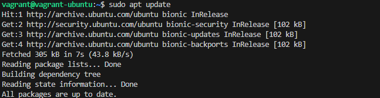
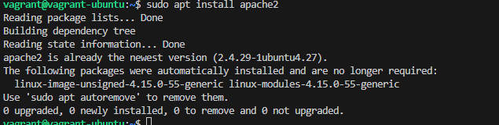
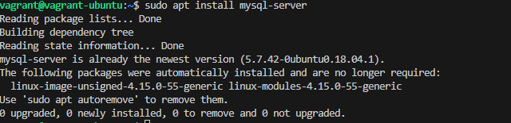
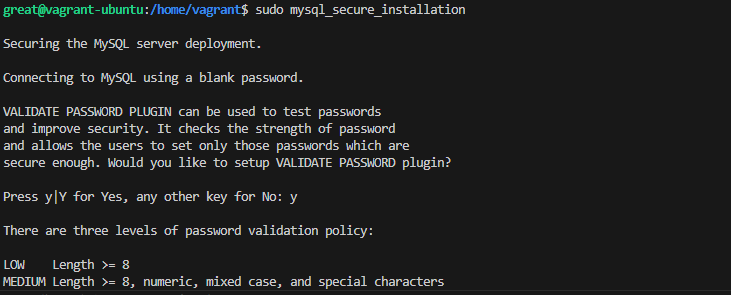
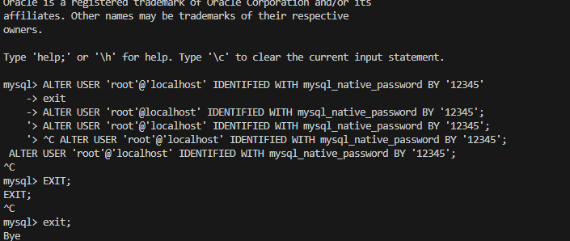
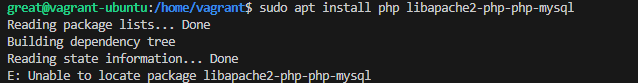
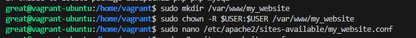
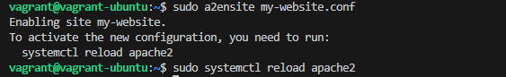
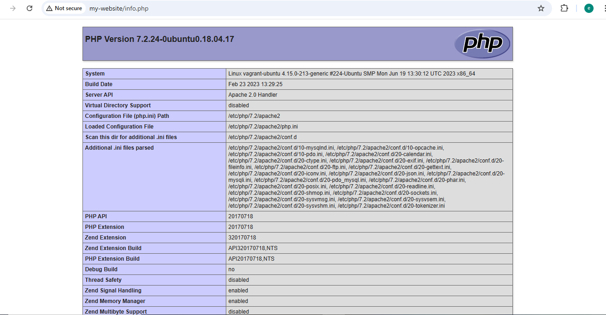
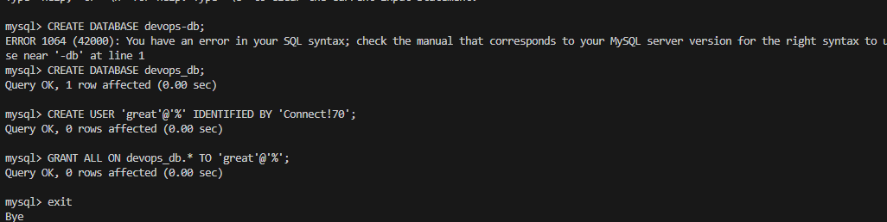

# Project on LAMP Stack Setup 

In this project, **I** set up a LAMP stack on an Ubuntu 22.04 server.  
LAMP stands for **Linux** (the operating system), **Apache** (the web server), **MySQL** (the database system), and **PHP** (the programming language).  
By the end, I had a fully working web server capable of hosting dynamic PHP applications.

---

## Step 1 — Installing Apache and Updating the Firewall
First, I updated the package manager cache:
```bash
sudo apt update
```

### I added Screenshots


Then, I installed Apache:
```bash
sudo apt install apache2
```

### I added Screenshots


I allowed HTTP traffic through the firewall:
```bash
sudo ufw allow in "Apache"
```
### I added Screenshots

---


## Step 2 — Installing MySQL
I installed MySQL:
```bash
sudo apt install mysql-server
```

I secured my MySQL installation by first logging in as root:
```bash
sudo mysql
```

Then, I changed the root user's authentication method for compatibility:
```sql
ALTER USER 'root'@'localhost' IDENTIFIED WITH mysql_native_password BY 'password';
```
I exited MySQL:
```bash
exit
```

Finally, I ran the MySQL security script:
```bash
sudo mysql_secure_installation
```
### I added Screenshots




---

## Step 3 — Installing PHP
I installed PHP along with the required Apache and MySQL PHP modules:
```bash
sudo apt install php libapache2-mod-php php-mysql
```
### I added screenshots

---

## Step 4 — Creating a Virtual Host for My Website
I created a directory for my website:
```bash
sudo mkdir /var/www/my-website
```

I gave ownership of the directory to my user:
```bash
sudo chown -R $USER:$USER /var/www/my-website
```

I created a virtual host configuration file:
```bash
sudo nano /etc/apache2/sites-available/my-website.conf
```

Inside, I added:
```apache
<VirtualHost *:80>
    ServerName my-website
    ServerAlias www.my-website 
    ServerAdmin webmaster@localhost
    DocumentRoot /var/www/my-website
    ErrorLog ${APACHE_LOG_DIR}/error.log
    CustomLog ${APACHE_LOG_DIR}/access.log combined
</VirtualHost>
```

I enabled my site and disabled the default one:
```bash
sudo a2ensite my-website
sudo a2dissite 000-default
```

I tested the Apache configuration:
```bash
sudo apache2ctl configtest
```

Then, I reloaded Apache:
```bash
sudo systemctl reload apache2
```
### I added Screenshots


---

## Step 5 — Testing PHP Processing
I created a test PHP file:
```bash
nano /var/www/my-website/info.php
```

I added:
```php
<?php
phpinfo();
```

I accessed the PHP info page in my browser:
```
http://my-website/info.php
```
### I added Screenshots


After confirming PHP worked, I removed the file:
```bash
sudo rm /var/www/my-website/info.php
```

---

## Step 6 — Testing Database Connection from PHP (Optional)
I logged into MySQL as root:
```bash
sudo mysql
```

I created a test database and user:
```sql
CREATE DATABASE example_database;
CREATE USER 'example_user'@'%' IDENTIFIED BY 'password';
GRANT ALL ON example_database.* TO 'example_user'@'%';
```

I exited MySQL:
```bash
exit
```

### I added screenshots



I created a PHP script to test the database connection:
```bash
nano /var/www/your_domain/todo_list.php
```

I added:
```php
<?php
$user = "example_user";
$password = "password";
$database = "example_database";
$table = "todo_list";

try {
  $db = new PDO("mysql:host=localhost;dbname=$database", $user, $password);
  echo "<h2>TODO</h2><ol>";
  foreach($db->query("SELECT content FROM $table") as $row) {
    echo "<li>" . $row['content'] . "</li>";
  }
  echo "</ol>";
} catch (PDOException $e) {
  print "Error!: " . $e->getMessage() . "<br/>";
  die();
}
?>
```

I then visited:
```
http://my-website/todo_list.php
```

---

