# LEMP Stack Project

## Prerequisites

- I used an **Ubuntu 20.04** server.
- I worked as a **non‑root user with sudo** privileges.

---

## Step 1 — Installing the Nginx Web Server

To serve web pages, I installed **Nginx** with `apt`.

First, I updated my package index and installed Nginx:

```bash
sudo apt update
sudo apt install nginx
```

## I added Screenshots
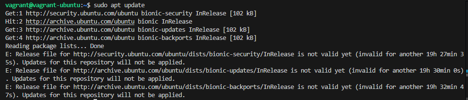
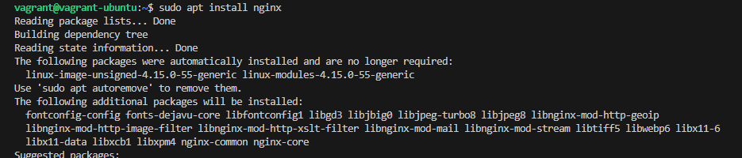

Once the installation finished, Nginx was active and running.

Because I use `ufw`, I allowed HTTP traffic to Nginx. I first checked the available application profiles:

```bash
sudo ufw app list
```

## I added Screenshots
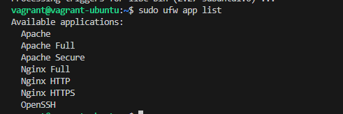

Since I hadn’t configured HTTPS yet, I enabled only **Nginx HTTP** (port 80):

```bash
sudo ufw allow 'Nginx HTTP'
```
## I added Screenshots


I verified the firewall rules:

```bash
sudo ufw status
```
## I added Screenshots
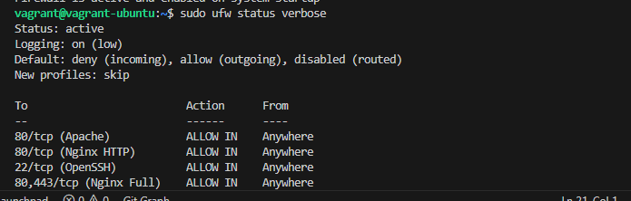

Next, I confirmed the server was reachable. If I didn’t know my public IP, I used one of these:

```bash
ip addr show eth0 | grep inet | awk '{ print $2; }' | sed 's/\/.*$//'
curl -4 icanhazip.com
```

## I added Screenshots
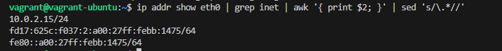


---


## Step 2 — Installing MySQL

With the web server up, I installed **MySQL** to store and manage data:

```bash
sudo apt install mysql-server
```

## I added Screenshots
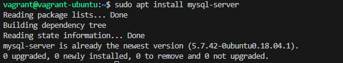

After installation, I ran MySQL’s security script to lock down defaults:

```bash
sudo mysql_secure_installation
```

## I added Screenshots
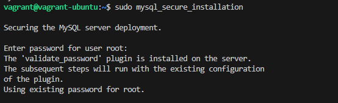

I then set a strong password for the MySQL **root** user. After finishing the prompts, I verified I could log in to the MySQL console:

```bash
sudo mysql
```

---

## Step 3 — Installing PHP

I installed **PHP-FPM** (the FastCGI process manager) and the MySQL PHP extension:

```bash
sudo apt install php-fpm php-mysql
```

At this point PHP was installed and ready to be wired into Nginx.

---

## Step 4 — Configuring Nginx to Use the PHP Processor

For this guide, I used `your_domain` as a placeholder. I created my site’s web root and set ownership to my user:

```bash
sudo mkdir -p /var/www/your_domain
sudo chown -R $USER:$USER /var/www/your_domain
```

Then I created a new Nginx server block:

```bash
sudo nano /etc/nginx/sites-available/your_domain
```


I enabled the site and disabled the default config:

```bash
sudo ln -s /etc/nginx/sites-available/your_domain /etc/nginx/sites-enabled/
sudo unlink /etc/nginx/sites-enabled/default
```

If needed later, I can restore the default:

```bash
sudo ln -s /etc/nginx/sites-available/default /etc/nginx/sites-enabled/
```

I tested the Nginx config and reloaded:

```bash
sudo nginx -t
sudo systemctl reload nginx
```

## I added Screenshots
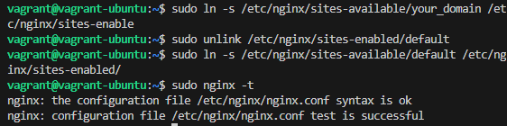

To verify the server block, I created a quick landing page:

```bash
nano /var/www/your_domain/index.html
```

## I added Screenshots
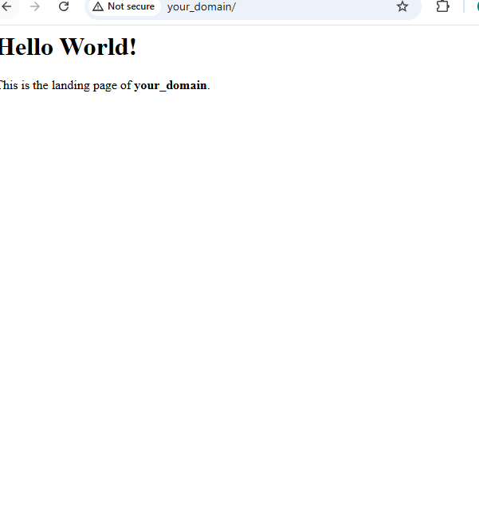

---

## Step 5 — Testing PHP with Nginx

I created a PHP info file to confirm Nginx handed `.php` to PHP-FPM correctly:

```bash
nano /var/www/your_domain/info.php
```

Then I browsed to:

```
http://your_domain/info.php
```

## I added Screenshots
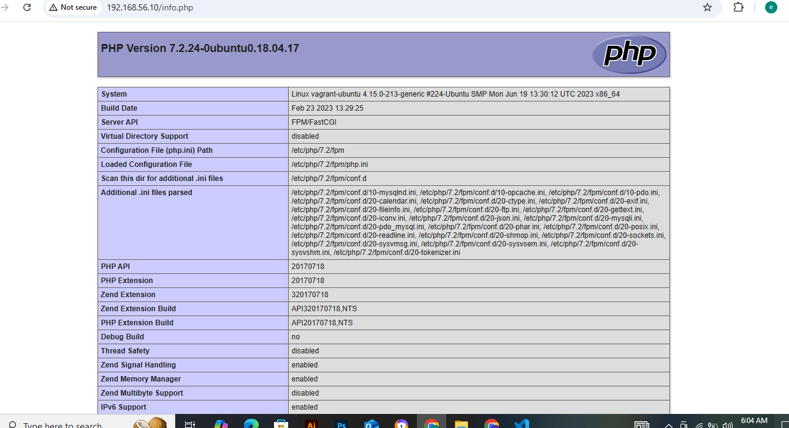

I saw PHP details, confirming PHP was wired up. Because it exposes sensitive info, I removed it afterward:

```bash
sudo rm /var/www/your_domain/info.php
```


---

## Step 6 —  Testing Database Connection from PHP

To test PHP ↔ MySQL queries, I created a test database and user. First I connected as root:

```bash
sudo mysql
```

I created a database and user (using `mysql_native_password` for compatibility with some PHP clients), then granted privileges:

```sql
CREATE DATABASE example_database;
CREATE USER 'example_user'@'%' IDENTIFIED WITH mysql_native_password BY 'password';
GRANT ALL ON example_database.* TO 'example_user'@'%';
exit
```

I confirmed access by logging in as the new user:

```bash
mysql -u example_user -p
```

Then I verified the database existed:

```sql
SHOW DATABASES;
```

I created a simple table and inserted sample rows:

```sql
CREATE TABLE example_database.todo_list (
    item_id INT AUTO_INCREMENT,
    content VARCHAR(255),
    PRIMARY KEY (item_id)
);
```
## I added Screenshots
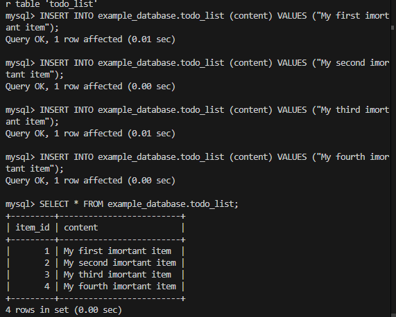

I exited MySQL:

```sql
exit
```

Next, I created a tiny PHP app to read from the table:

```bash
nano /var/www/your_domain/todo.php
```
## I added Screenshots
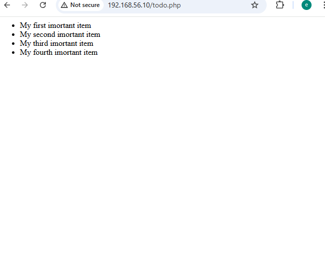

I saw the items from `todo_list`, proving PHP could query MySQL through PDO.
