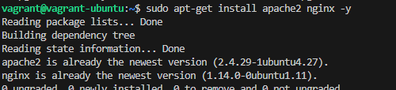
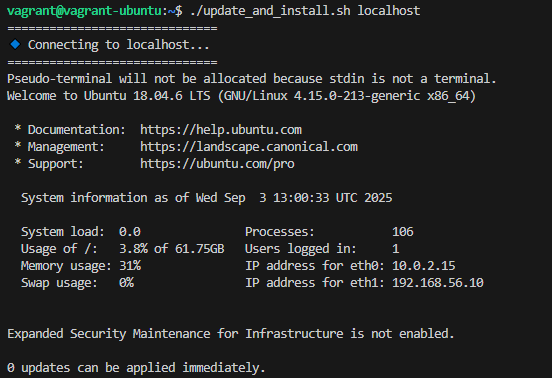
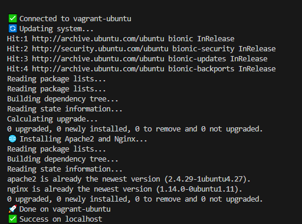
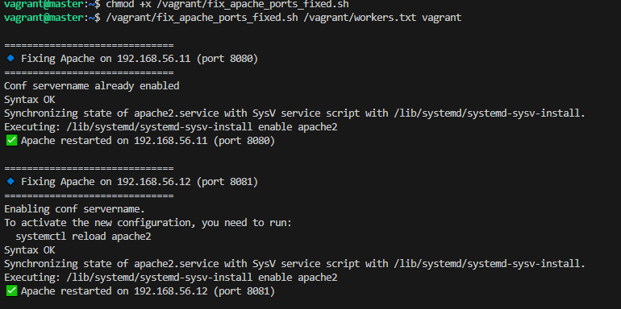
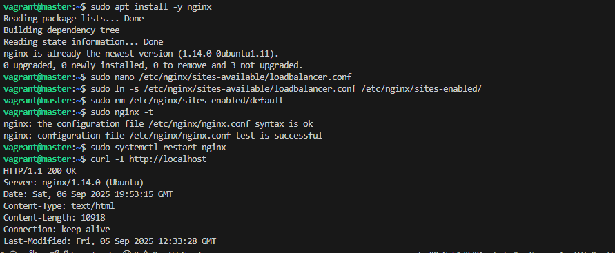
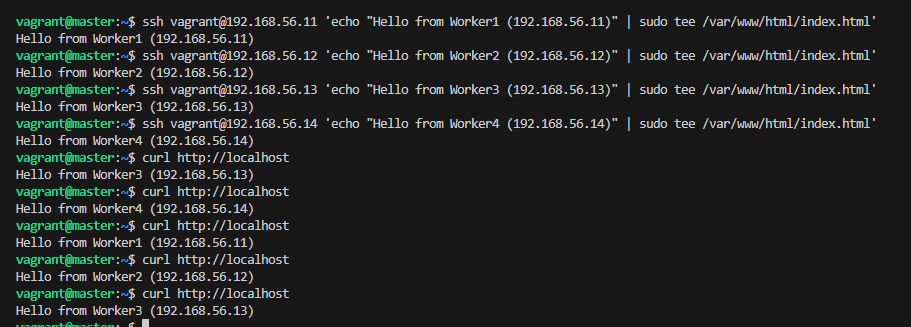

# Automated Server Update and Web Server Installation Script Project

##  Project Description  
This project automates the deployment and maintenance of multiple servers. Using a single shell script, system administrators can remotely:  
- Update servers  
- Install **Apache2** and **Nginx**  
- Configure Apache2 to avoid port conflicts  
- Enable Nginx as a **load balancer**  

The automation ensures consistency, reduces manual work, and minimizes errors during server setup.  

---

## Project Goals  
- **Efficiency**: Update and configure multiple servers in one run.  
- **Automation**: No manual package installation required.  
- **Uniformity**: All servers get identical configurations.  
- **Ease of Use**: Just provide a server list and username.  
- **Error Handling**: Clear logs and informative messages during execution.  

---

## Project Setup  

### 1. Prerequisites  
I created a shell script that automates the deployment process of multiple servers.This script remotely accesses five servers, performs system updates, and installs both Apache2 and Nginx web servers.By automating these tasks, I streamlined server maintenance and web server setup.

- Ubuntu servers (tested on Ubuntu 18.04/20.04/22.04).  
- SSH key-based authentication configured between the master and worker nodes.  
- A text file containing worker IP addresses (e.g., `workers.txt`).  

Example `workers.txt`:  
```
192.168.56.11
192.168.56.12
192.168.56.13
192.168.56.14
```

### I added Screenshots



---

### 2. Usage  

I Ran the automation script:  
```bash
/vagrant/deploy_web_stack.sh /vagrant/workers.txt vagrant
```
### i added Screenshots



This will:  
- Connect to each worker server via SSH.  
- Update system packages.  
- Install Apache2 and Nginx.  
- Configure Apache2 to use unique ports (`8080`, `8081`, …).  
- Restart services and verify with `curl`.  

---

### 3. Load Balancer Setup  

On the **master server**, I created a load balancer config:  
```bash
sudo nano /etc/nginx/sites-available/loadbalancer.conf
```

Example config:  
```nginx
upstream backend {
    server 192.168.56.11:8080;
    server 192.168.56.12:8081;
    server 192.168.56.13:8082;
    server 192.168.56.14:8083;
}

server {
    listen 80;

    location / {
        proxy_pass http://backend;
    }
}
```

Enable the site and restart Nginx:  
```bash
sudo ln -s /etc/nginx/sites-available/loadbalancer.conf /etc/nginx/sites-enabled/
sudo rm /etc/nginx/sites-enabled/default
sudo nginx -t
sudo systemctl restart nginx
```

Verify:  
```bash
curl -I http://localhost
```

Response:  
```
HTTP/1.1 200 OK
```

### I added Screenshots

---

## Testing & Results  
- Each worker server responded with `HTTP/1.1 200 OK` on its assigned port.  
- The load balancer served traffic successfully on port **80**.  
- Error messages were handled gracefully with logs.  

---

## 🛠 Error Handling  
- If a server is unreachable → script logs it and moves on.  
- If Apache fails due to port conflicts → script fixes `ports.conf` automatically.  
- If Nginx syntax is invalid → `nginx -t` catches it before restart.  

---

### I added Screenshots



## Documentation for Users  
This script automates the process of updating multiple remote servers and installing both Apache2 and Nginx web servers. It uses SSH to access the servers, performs updates, installs the required packages, and reports success or errors.

## Prerequisites
Before using the script, make sure:

- You are running the script on a Linux machine with bash.
- You have SSH key-based authentication set up with each remote server.  
  *This avoids the need to type passwords during execution.*
- The user running the script has sudo privileges on the remote servers.
- The servers are Ubuntu-based (20.04/22.04 or compatible).

## Script Parameters
The script accepts one or more server addresses (IP or hostname) as input parameters.

**Format:**
```bash
./server_setup.sh server1 server2 server3 ...
Example:

bash
Copy code
./server_setup.sh 192.168.1.10 192.168.1.11 webserver.example.com
What the Script Does
For each server provided:

Connects to the server using SSH.

Updates the package lists and upgrades installed packages.

Installs Apache2.

Installs Nginx.

Verifies installation and reports success or failure.

Example Run
bash
Copy code
$ ./server_setup.sh 192.168.1.10 192.168.1.11

[192.168.1.10] Updating system packages...
[192.168.1.10] System update completed.
[192.168.1.10] Installing Apache2...
[192.168.1.10] Apache2 installation successful.
[192.168.1.10] Installing Nginx...
[192.168.1.10] Nginx installation successful.

[192.168.1.11] Updating system packages...
[192.168.1.11] System update completed.
[192.168.1.11] Installing Apache2...
[192.168.1.11] Apache2 installation successful.
[192.168.1.11] Installing Nginx...
[192.168.1.11] Nginx installation successful.

All servers updated and web servers installed successfully.
Error Handling
The script includes error detection and clear messages:

If SSH connection fails:

pgsql
Copy code
[server] ERROR: Could not connect via SSH. Check your server address or SSH keys.
If system update fails:

pgsql
Copy code
[server] ERROR: Failed to update system packages.
If installation fails:

csharp
Copy code
[server] ERROR: Apache2 installation failed.
or

csharp
Copy code
[server] ERROR: Nginx installation failed.
Best Practices
Always test the script on one server before applying it to multiple servers.

Run the script during maintenance windows to avoid disrupting active services.

Regularly review and update the script to match your organization’s security policies.

Use a centralized log file (modify the script to append output to deployment.log) for tracking executions.

Troubleshooting
SSH Authentication Issues
Ensure your public key is in ~/.ssh/authorized_keys on the remote servers.

Test manually:

bash
Copy code
ssh username@server_ip
Permission Denied
Make sure your user has sudo privileges.

Add NOPASSWD to sudoers if password prompts block automation.

Firewall Blocking
Ensure port 22 (SSH) is open.

For web testing, ensure ports 80 (HTTP) and 443 (HTTPS) are open.

Verification
After running the script:

Test Apache2:

bash
Copy code
curl http://server_ip
You should see the Apache2 default page.

Test Nginx:

bash
Copy code
curl http://server_ip:8080   # or whichever port Nginx is configured
```
---

### This script saves time, ensures consistency, and reduces errors in deploying and updating multiple servers. By following this guide, system administrators can efficiently manage their server infrastructure with minimal manual intervention.