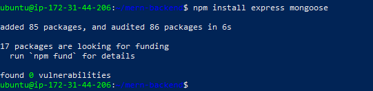
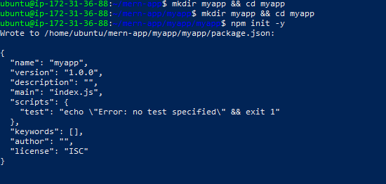
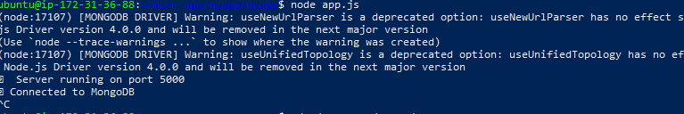
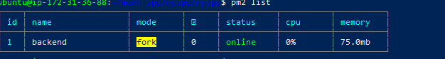
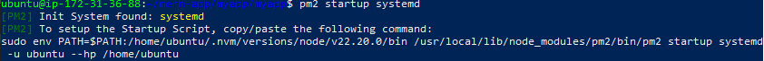
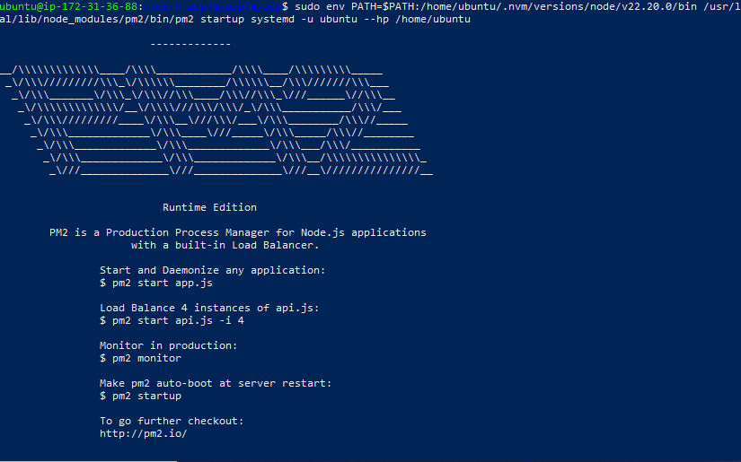
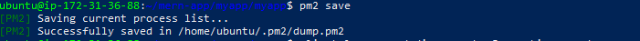

# Deploying a MERN Stack on an EC2 Instance

This document shows how I set up a MERN environment on an **EC2 Ubuntu instance**, with backend running via **Node.js + MongoDB**, and managed with **PM2**.

---

## 1. Initial Project Setup

I created the project folder and initialized frontend + backend.

```bash
mkdir mern-app && cd mern-app
npx create-react-app frontend
```
 the frontend was created successfully and ran on port `3000`.

```bash
npm start
```

Output:
```
Compiled successfully!
You can now view frontend in the browser.
Local:            http://localhost:3000
```
### I added Screenshots


---

## 2. Backend Setup

Inside the backend folder:

```bash
cd ~/mern-app/myapp/myapp
node app.js
```

### Errors / Warnings Encountered
- MongoDB driver warnings:
  ```
  [MONGODB DRIVER] Warning: useNewUrlParser is a deprecated option


Despite this, the backend worked correctly:
```
🚀 Server running on port 5000
✅ Connected to MongoDB
```
### I added Screenshots

---

## 3. Testing Backend

From inside EC2:
```bash
curl http://localhost:5000
```
Output:
```
Hello from Node.js + MongoDB on EC2!
```

Initially we got:
```
curl: (7) Failed to connect to localhost port 5000 after 0 ms: Connection refused
```
This was because the backend server was not running yet. After restarting `app.js`, it worked.

---

### I added screenshots

## 4. Running Backend with PM2

We used **PM2** to keep the backend alive:

```bash
pm2 start app.js --name backend
```

Checking processes:
```bash
pm2 list
```

### I added screenshots

---

## 5. PM2 Startup (Autostart on Reboot)

We enabled PM2 startup scripts so the app runs automatically after reboot:

```bash
pm2 startup systemd
```

It asked us to run:
```bash
sudo env PATH=$PATH:/home/ubuntu/.nvm/versions/node/v22.20.0/bin /usr/local/lib/node_modules/pm2/bin/pm2 startup systemd -u ubuntu --hp /home/ubuntu
```

Then we saved the running processes:
```bash
pm2 save
```
### I added Screenshots



---

## 6. External Access on EC2

- Added **port 5000** inbound rule in EC2 Security Group.
- Accessed from browser:
  ```
  http://<16.171.198.155>:5000
  ```

Output:
```
Hello from Node.js + MongoDB on EC2!
```

---

##  Final Result

- Frontend: running on port **3000**
- Backend: running on port **5000**, managed by **PM2**, survives reboots
- MongoDB connected successfully
- Errors (deprecations, connection refused) were resolved

---
