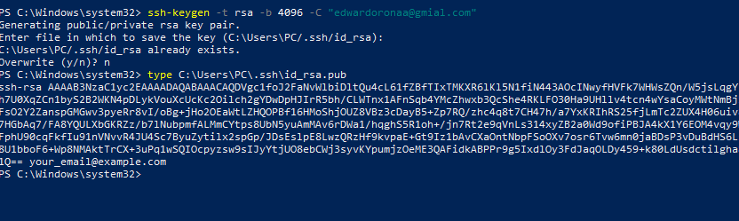
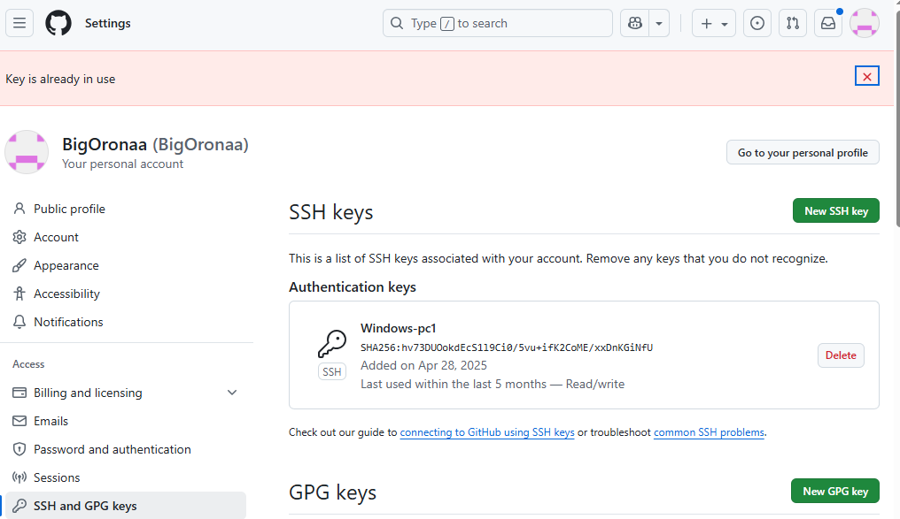
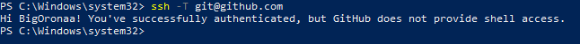

# SSH Agent Lab Guide (Using Existing SSH Key)

---

## Step 1: Verify Existing SSH Key

Instead of generating a new key, I checked if one already existed on the system.
The default location for SSH keys is:

```
C:\Users\PC\.ssh\id_rsa
C:\Users\PC\.ssh\id_rsa.pub
```

Since an existing key was already present, i decided **not to overwrite it**.

---

## Step 2: Check if the Key is Already Connected to GitHub

I attempted to authenticate with GitHub using the command:

```powershell
ssh -T git@github.com
```

### Expected Output

```
Hi BigOronaa! You've successfully authenticated, but GitHub does not provide shell access.
```

### Result

✅ Success! This confirmed:

* The SSH key is already added to GitHub.
* The key is linked to the account **BigOronaa**.
* No new key generation was required.

---

No password will be required because authentication uses the SSH key.


---

## Final Verification

I confirmed the key is working properly with GitHub. The setup is complete, and SSH authentication is now ready for use in projects.

### I added Screenshots


